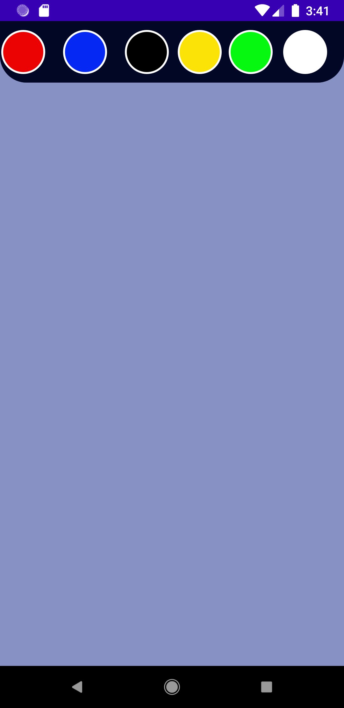
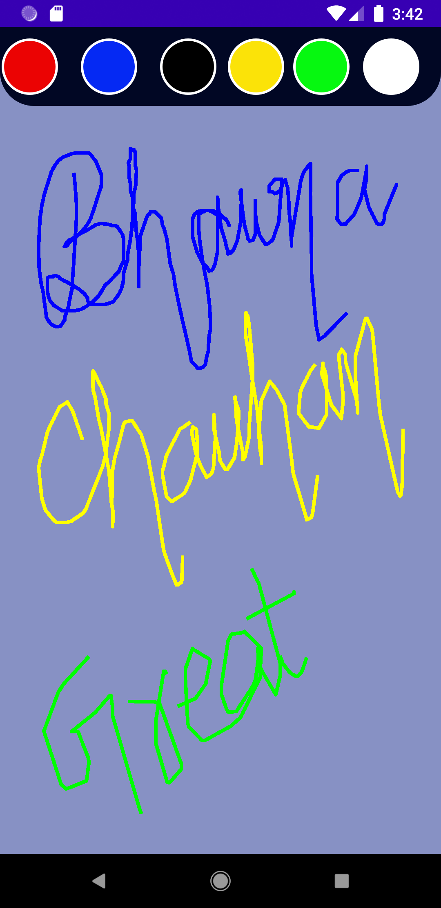

# Prerequisite
* Android Studio installed in your system.
   

🚀 Language used in creating this is Kotlin 
  
  
⚡**UI** of  App
 

  

  

  

<h4 align= "centre"> 🙋‍♂️If you are facing any issue then free to contact me through email</h2>

- 📫Email : bhawnabc2002@gmail.com
  
  

